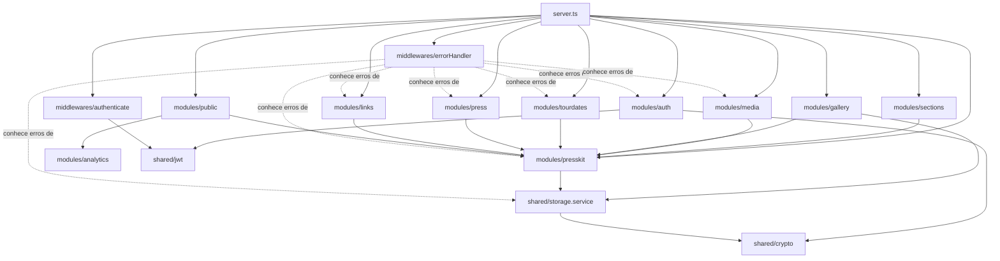
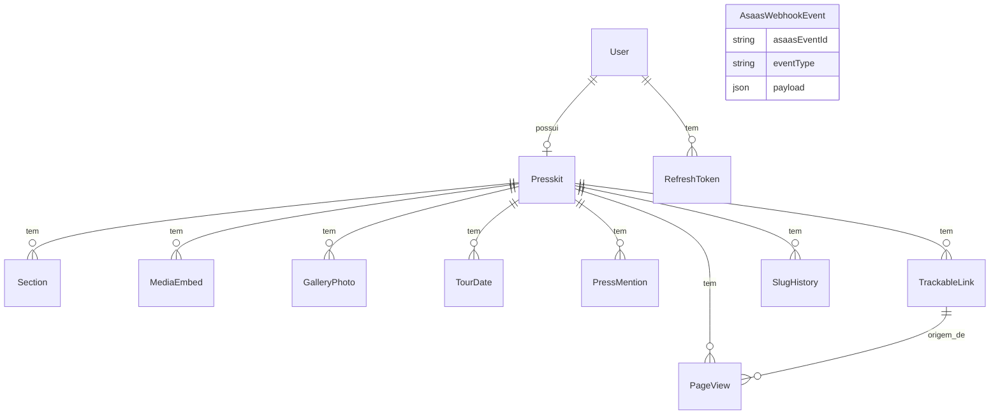

# Arquitetura — Presskit.AI

Monorepo (npm workspaces) com quatro pacotes:

- **`backend`** (`@presskit/api`) — Fastify + Prisma + PostgreSQL. API REST autenticada
  por JWT (access token curto + refresh token opaco rotativo).
- **`frontend`** (`@presskit/dashboard`) — React + Vite. Dashboard onde o artista edita
  o presskit (autenticado).
- **`ladingpage`** (`@presskit/site`) — Next.js. Marketing (`/`) e a página pública do
  presskit (`/[slug]`), renderizada no servidor para SEO/OG.
- **`packages/shared`** (`@presskit/shared`) — schemas Zod, constantes de domínio
  (planos, categorias, seções) e os componentes de renderização do presskit
  (`ui/PresskitRenderer` e blocos), consumidos tanto pelo dashboard (preview ao vivo)
  quanto pela landing page (página pública) — uma única fonte de verdade para como um
  presskit é desenhado.

## Camadas no backend

Cada domínio de negócio é uma pasta em `backend/src/modules/`, com no máximo dois
arquivos: `*.routes.ts` (handlers Fastify — validação de entrada com Zod, sem regra de
negócio) e `*.service.ts` (regra de negócio + acesso a dados via Prisma). Não há uma
camada de "repository" separada: o Prisma Client já é o data-access layer, e outra
camada por cima dele só adicionaria indireção sem ganho.

```
modules/
  auth/        cadastro, login, refresh/rotação de token, logout
  presskit/    CRUD do presskit, publish/unpublish, tema — o hub de posse (ver abaixo)
  sections/    conteúdo das seções singulares (bio, contato, tech rider, custom)
  media/       embeds de música/vídeo (Spotify/YouTube/SoundCloud/Vimeo)
  gallery/     upload e ordenação de fotos (presign R2 + confirmação)
  tourdates/   agenda de shows
  press/       clipping de imprensa
  links/       links rastreáveis (UTM-like, por código)
  analytics/   gravação de page views (ainda sem endpoint de leitura — ver observação)
  public/      endpoints públicos (sem auth): lookup de presskit por slug, registro de view
shared/        infraestrutura cross-cutting, não é um domínio de negócio:
  storage.service.ts   presign/HEAD/delete no R2 (usado por gallery/ e presskit/)
  jwt.ts                assinatura/verificação do access token (usado por auth/ e middlewares/)
  crypto.ts              hash/token opaco (usado por auth/ e shared/storage)
middlewares/    authenticate (decorator fastify.authenticate) e errorHandler (mapeia
                classes de erro de todo módulo para status HTTP)
config/         env.ts (schema Zod das variáveis de ambiente) e prisma.ts (client)
```

### `presskit.service.ts` é o hub de posse

Quase todo módulo filho (`sections`, `media`, `gallery`, `tourdates`, `press`,
`links`) chama `getOwnedPresskitOrThrow(userId)` de `modules/presskit/presskit.service.ts`
antes de agir — é o único lugar que resolve "este usuário é dono deste presskit?".
Isso é intencional, não acoplamento acidental: evita reimplementar a checagem de posse
em oito lugares diferentes, ao custo de todo módulo filho depender de `presskit/`.

`middlewares/errorHandler.ts` é o único arquivo que importa classes de erro de todos os
módulos — também intencional: é o único lugar que precisa saber "este tipo de erro
service vira este status HTTP", então centralizar ali é mais simples do que cada rota
tratar seu próprio erro.



> **Observação**: `modules/analytics/pageView.service.ts` hoje só grava (chamado por
> `public/public.routes.ts` a cada visita) — não existe ainda um endpoint de leitura
> nem uma tela de analytics no dashboard. Ele já vive em seu próprio módulo para ser o
> lugar natural onde esse endpoint de leitura entra depois, sem precisar mover nada.

## Modelo de dados



> `AsaasWebhookEvent` e os campos `asaasCustomerId`/`subscriptionStatus` em `User` já
> existem no schema mas ainda não têm nenhum código que os popule — billing (cobrança
> via Asaas) é a próxima fase de produto, não uma feature já ativa.

## Frontend do dashboard

`frontend/src/components/layout/DashboardLayout.tsx` é o layout de toda a área
logada (sidebar + `<Outlet/>`). O editor do presskit (Bio, Contato, Galeria, Tour
Dates, Links, Tema) continua em `pages/DashboardHomePage.tsx`, agora como uma rota
filha do layout. Novas áreas do produto (módulo "Projeto": Crie com IA / Uploads /
Modelos prontos) entram como outras rotas filhas do mesmo layout, em
`pages/projeto/`.
