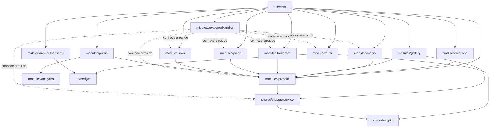
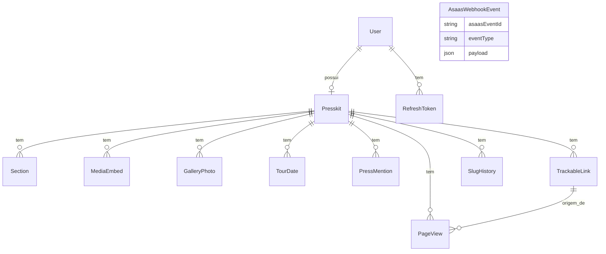

# Arquitetura — Presskit.AI

Monorepo (npm workspaces) com quatro pacotes:

- **`backend`** (`@presskit/api`) — Fastify + Prisma + PostgreSQL. API REST autenticada
  por JWT (access token curto + refresh token opaco rotativo).
- **`frontend`** (`@presskit/dashboard`) — React + Vite. Dashboard onde o artista edita
  o presskit (autenticado).
- **`ladingpage`** (`@presskit/site`) — Next.js. Marketing (`/`) e a página pública do
  presskit (`/[slug]`), renderizada no servidor para SEO/OG.
- **`packages/shared`** (`@presskit/shared`) — schemas Zod, constantes de domínio
  (planos, categorias, seções) e os componentes de renderização do presskit
  (`ui/PresskitRenderer` e blocos), consumidos tanto pelo dashboard (preview ao vivo)
  quanto pela landing page (página pública) — uma única fonte de verdade para como um
  presskit é desenhado.

## Camadas no backend

Cada domínio de negócio é uma pasta em `backend/src/modules/`, com no máximo dois
arquivos: `*.routes.ts` (handlers Fastify — validação de entrada com Zod, sem regra de
negócio) e `*.service.ts` (regra de negócio + acesso a dados via Prisma). Não há uma
camada de "repository" separada: o Prisma Client já é o data-access layer, e outra
camada por cima dele só adicionaria indireção sem ganho.

```
modules/
  auth/        cadastro, login, refresh/rotação de token, logout
  presskit/    CRUD do presskit, publish/unpublish, tema — o hub de posse (ver abaixo)
  sections/    conteúdo das seções singulares (bio, contato, tech rider, custom)
  media/       embeds de música/vídeo (Spotify/YouTube/SoundCloud/Vimeo)
  gallery/     upload e ordenação de fotos (presign R2 + confirmação)
  tourdates/   agenda de shows
  press/       clipping de imprensa
  links/       links rastreáveis (UTM-like, por código)
  analytics/   gravação de page views (ainda sem endpoint de leitura — ver observação)
  public/      endpoints públicos (sem auth): lookup de presskit por slug, registro de view
shared/        infraestrutura cross-cutting, não é um domínio de negócio:
  storage.service.ts   presign/HEAD/delete no R2 (usado por gallery/ e presskit/)
  jwt.ts                assinatura/verificação do access token (usado por auth/ e middlewares/)
  crypto.ts              hash/token opaco (usado por auth/ e shared/storage)
middlewares/    authenticate (decorator fastify.authenticate) e errorHandler (mapeia
                classes de erro de todo módulo para status HTTP)
config/         env.ts (schema Zod das variáveis de ambiente) e prisma.ts (client)
```

### `presskit.service.ts` é o hub de posse

Quase todo módulo filho (`sections`, `media`, `gallery`, `tourdates`, `press`,
`links`) chama `getOwnedPresskitOrThrow(userId)` de `modules/presskit/presskit.service.ts`
antes de agir — é o único lugar que resolve "este usuário é dono deste presskit?".
Isso é intencional, não acoplamento acidental: evita reimplementar a checagem de posse
em oito lugares diferentes, ao custo de todo módulo filho depender de `presskit/`.

`middlewares/errorHandler.ts` é o único arquivo que importa classes de erro de todos os
módulos — também intencional: é o único lugar que precisa saber "este tipo de erro
service vira este status HTTP", então centralizar ali é mais simples do que cada rota
tratar seu próprio erro.


```mermaid
graph TD
  server[server.ts] --> auth[modules/auth]
  server --> presskit[modules/presskit]
  server --> sections[modules/sections]
  server --> media[modules/media]
  server --> gallery[modules/gallery]
  server --> tourdates[modules/tourdates]
  server --> press[modules/press]
  server --> links[modules/links]
  server --> public[modules/public]
  server --> errorHandler[middlewares/errorHandler]
  server --> authenticate[middlewares/authenticate]

  sections --> presskit
  media --> presskit
  gallery --> presskit
  tourdates --> presskit
  press --> presskit
  links --> presskit
  public --> presskit
  public --> analytics[modules/analytics]

  gallery --> storage[shared/storage.service]
  presskit --> storage
  auth --> crypto[shared/crypto]
  storage --> crypto
  auth --> jwtShared[shared/jwt]
  authenticate --> jwtShared

  errorHandler -.conhece erros de.-> auth
  errorHandler -.conhece erros de.-> presskit
  errorHandler -.conhece erros de.-> media
  errorHandler -.conhece erros de.-> tourdates
  errorHandler -.conhece erros de.-> press
  errorHandler -.conhece erros de.-> links
  errorHandler -.conhece erros de.-> storage
```

> **Observação**: `modules/analytics/pageView.service.ts` hoje só grava (chamado por
> `public/public.routes.ts` a cada visita) — não existe ainda um endpoint de leitura
> nem uma tela de analytics no dashboard. Ele já vive em seu próprio módulo para ser o
> lugar natural onde esse endpoint de leitura entra depois, sem precisar mover nada.

## Modelo de dados


```mermaid
erDiagram
  User ||--o| Presskit : possui
  User ||--o{ RefreshToken : tem

  Presskit ||--o{ Section : tem
  Presskit ||--o{ MediaEmbed : tem
  Presskit ||--o{ GalleryPhoto : tem
  Presskit ||--o{ TourDate : tem
  Presskit ||--o{ PressMention : tem
  Presskit ||--o{ TrackableLink : tem
  Presskit ||--o{ PageView : tem
  Presskit ||--o{ SlugHistory : tem

  TrackableLink ||--o{ PageView : origem_de

  AsaasWebhookEvent {
    string asaasEventId
    string eventType
    json payload
  }
```

> Cobrança: `Subscription` (um por preapproval do Mercado Pago), `Payment` (uma por cobrança),
> `PaymentWebhookEvent` (dedup/auditoria dos webhooks) e `Feedback` — ver seção "Cobrança".

## Papéis e painel de administração

`User.role` é `USER` ou `SUPERADMIN`. Toda rota `/admin/*` passa por `authenticate` +
`requireSuperadmin` (o papel é relido do banco a cada request, nunca do JWT). O primeiro
operador nasce pela env `SUPERADMIN_EMAILS` (promovido no próximo login/cadastro); depois
disso a promoção é feita no próprio painel. Ninguém altera o próprio papel e o último
superadmin não pode ser rebaixado.

O painel (`frontend/src/pages/admin/`) cobre: visão geral (MRR, receita, assinaturas,
usuários ativos, visitas, feedback, séries de 30 dias), usuários (+ detalhe), assinaturas,
pagamentos (+ webhooks recebidos), inadimplência e feedback.

## Cobrança (Mercado Pago)

Modelo: **assinatura recorrente via Preapproval**, checkout hospedado pelo Mercado Pago
(`init_point`) — nenhum dado de cartão passa pela nossa stack. Preços vivem em
`packages/shared/src/constants/billing.ts` (`BILLING_PLANS`); o backend cobra sempre
`cycleTotalCents(cycle)`, o cliente só escolhe o ciclo.

Fluxo em `backend/src/modules/billing/`:

1. `POST /billing/checkout` cria a `Subscription` local (PENDING) e o preapproval no MP com
   `external_reference = subscription.id` e `back_url = PUBLIC_DASHBOARD_URL/assinatura?retorno=mp`.
   O painel redireciona para o `init_point`.
2. Ao voltar, o painel chama `POST /billing/sync`, que relê o preapproval — assim a confirmação
   não depende do webhook ter chegado.
3. `POST /webhooks/mercadopago` recebe `payment`, `subscription_preapproval` e
   `subscription_authorized_payment`. O corpo **nunca é confiado**: só o id é usado para
   re-consultar o recurso na API do MP. `x-signature` é validada quando
   `MERCADOPAGO_WEBHOOK_SECRET` existe. Cada evento vira uma linha em `PaymentWebhookEvent`
   (dedup + erro visível no painel); falha de processamento responde 500 para o MP retentar.
4. `runBillingHousekeeping` roda a cada hora (e via "Reconciliar" no painel): expira checkouts
   abandonados, ressincroniza assinaturas abertas e rebaixa quem teve o período pago encerrado.

Regras de estado (`billing.service.ts`):

- `User.planKey` é **derivado** por `syncEntitlement`: PRO enquanto houver assinatura AUTHORIZED
  sem atraso, ou CANCELLED/PAUSED ainda dentro do período pago. Usuário sem nenhuma
  `Subscription` não é tocado — é assim que um override manual do superadmin sobrevive.
- Inadimplência = assinatura AUTHORIZED com `failedCharges > 0` ou período pago vencido há
  mais de `BILLING_GRACE_DAYS` (3). Pagamento aprovado zera `failedCharges`, limpa `pastDue` e
  abre um novo período (`currentPeriodEnd = paidAt + meses do ciclo`).
- Cancelar mantém o PRO até `currentPeriodEnd`.

Configuração no MP: criar a aplicação, pegar o access token (teste → produção) e, em
"Suas integrações › Webhooks", apontar para `https://<api>/webhooks/mercadopago` com os três
tópicos acima; a chave secreta gerada vai em `MERCADOPAGO_WEBHOOK_SECRET`.

## Feedback

`POST /feedback` (usuário autenticado, 5/min) grava tipo, nota 1–5 opcional e mensagem;
`GET /feedback/mine` mostra o histórico com a resposta do admin (`adminNote`). O superadmin
triagem em `/admin/feedback` (status NOVO → EM_ANALISE → RESOLVIDO).

## Links de mídia (YouTube, Vimeo, Spotify, SoundCloud)

`packages/shared/src/media/parseMediaUrl.ts` é a única fonte de verdade para "esse link é
embedável, de qual provedor, e qual `src` vai no iframe". É usado em três lugares com o mesmo
resultado: o backend (`mediaEmbedCreateSchema`) rejeita links que não viram player; o editor
(`EmbedManager`) detecta o provedor a partir do link colado (sem dropdown); e o renderizador
público (`MediaEmbedBlock`) monta o iframe a partir do `embedSrc` — nunca da URL crua. YouTube
é embedado via `youtube-nocookie.com`.

## Segurança — decisões que não são óbvias no código

- **Toda URL que chega do cliente passa por `httpUrlSchema`** (`packages/shared/src/schemas/url.ts`),
  não por `z.string().url()` — este último aceita `javascript:` e `data:`, que viram XSS em
  qualquer `href`. Links de mídia são a exceção controlada: passam por `parseMediaUrl`.
- **Chaves de storage (R2) são sempre verificadas contra o prefixo do próprio presskit**
  (`assertOwnedStorageKey`) antes de confirmar ou apagar. Sem isso, confirmar a chave de outro
  artista e depois apagar a linha faria a API deletar o objeto dele. A URL pública é derivada no
  servidor (`publicUrlFor`), nunca aceita do cliente. Por isso `themeBackgroundImageUrl/Key`
  não existem em `presskitUpdateSchema` — só mudam via as rotas de upload.
- **Refresh token**: rotação a cada uso; apresentar um token já revogado é tratado como roubo
  e revoga todas as sessões do usuário. Login sempre executa um `bcrypt.compare` (contra um
  hash fictício se o e-mail não existe) para não vazar quais e-mails têm conta via timing.
- **Rate limit**: bucket global generoso (600/min/IP) porque a página pública é renderizada
  pelo serviço `landing`, logo todo o tráfego de visitantes chega à API de um único IP. Rotas de
  credencial (`/auth/login`, `/auth/signup`) têm bucket próprio de 10/min. `trustProxy: true`
  é obrigatório no Railway para que `request.ip` seja o cliente, não o proxy.
- **Headers de segurança/CSP**: landing em `next.config.ts` (`headers()`), dashboard em
  `frontend/public/serve.json` (lido pelo `serve` em produção), API via `@fastify/helmet`.
  A CSP da landing ainda usa `'unsafe-inline'` em scripts (Next injeta bootstrap inline); migrar
  para nonce via `proxy.ts` é o próximo passo.
- **Tokens no `localStorage`** (dashboard e landing) é a troca consciente atual: três origens
  diferentes tornam cookies `httpOnly` cross-site + CSRF um projeto à parte. O access token dura
  15 min e a CSP reduz a superfície de XSS enquanto isso.

## Deploy (Railway)

Projeto `presskit`, quatro serviços a partir do mesmo repositório (root = raiz do monorepo):

| Serviço   | Build                                        | Start                                        | Health   |
|-----------|----------------------------------------------|----------------------------------------------|----------|
| backend   | `npm run build --workspace=@presskit/api`    | `npm run start --workspace=@presskit/api`    | `/health`|
| frontend  | `npm run build --workspace=@presskit/dashboard` | `npm run start --workspace=@presskit/dashboard` (`serve -s dist`) | `/` |
| landing   | `npm run build --workspace=@presskit/site`   | `npm run start --workspace=@presskit/site`   | `/`      |
| Postgres  | template oficial                             | —                                            | —        |

- `backend` roda `npm run prisma:deploy --workspace=@presskit/api` como **pre-deploy command**
  (uma vez por deploy, antes do start — não a cada restart de réplica).
- Watch paths por serviço (`backend/**`, `frontend/**`, `ladingpage/**`, cada um + `packages/**`
  e os `package*.json` da raiz), para um push só redeployar o que mudou.
- `railway.json` (config-as-code) está **deprecado** no Railway — a configuração vive nas
  settings de cada serviço (aplicadas via API/dashboard).

Variáveis por serviço (além das injetadas pelo Railway):

- **backend**: `NODE_ENV=production`, `DATABASE_URL=${{Postgres.DATABASE_URL}}`,
  `JWT_ACCESS_SECRET`, `CORS_ORIGINS` (frontend + landing, separados por vírgula),
  `SUPERADMIN_EMAILS`, `PUBLIC_DASHBOARD_URL` (frontend). Cobrança: `MERCADOPAGO_ACCESS_TOKEN`,
  `MERCADOPAGO_WEBHOOK_SECRET`. Upload de imagens: `R2_ACCOUNT_ID`, `R2_ACCESS_KEY_ID`,
  `R2_SECRET_ACCESS_KEY`, `R2_BUCKET`, `R2_PUBLIC_BASE_URL`.
- **frontend**: `VITE_API_URL` (backend), `VITE_SITE_URL` (landing) — inlined no build.
- **landing**: `NEXT_PUBLIC_API_URL` (backend), `NEXT_PUBLIC_DASHBOARD_URL` (frontend) — inlined no
  build; opcionalmente `API_URL` para o SSR falar com o backend pela rede privada.

Ao trocar para domínios próprios, atualizar essas variáveis (e `CORS_ORIGINS`) e redeployar
frontend e landing, já que as `VITE_*`/`NEXT_PUBLIC_*` são resolvidas em build.

## Frontend do dashboard

`frontend/src/components/layout/DashboardLayout.tsx` é o layout de toda a área
logada (sidebar + `<Outlet/>`). O editor do presskit (Bio, Contato, Galeria, Tour
Dates, Links, Tema) continua em `pages/DashboardHomePage.tsx`, agora como uma rota
filha do layout. Novas áreas do produto (módulo "Projeto": Crie com IA / Uploads /
Modelos prontos) entram como outras rotas filhas do mesmo layout, em
`pages/projeto/`.
